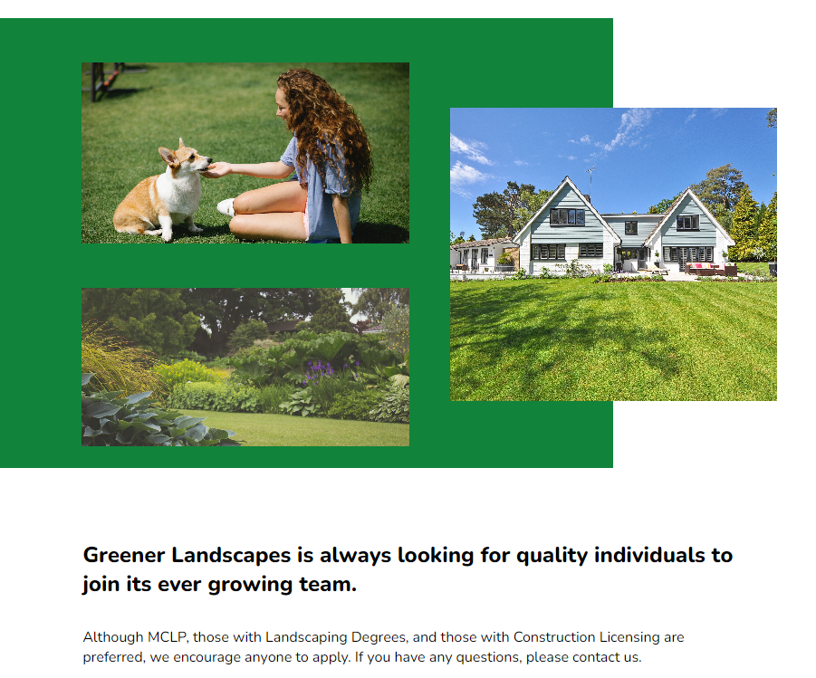

# Frontend Mentor - News homepage solution

This is a solution to the [Ableton Front End Practice Challenge](https://www.frontendpractice.com/projects/ableton). Frontend Practice gives you the ideas and resources to start building wonderful websites. 
## Table of contents

- [Overview](#overview)
  - [The challenge](#the-challenge)
  - [Screenshot](#screenshot)
  - [Links](#links)
- [My process](#my-process)
  - [Built with](#built-with)
  - [What I learned](#what-i-learned)
  - [Continued development](#continued-development)
  - [Useful resources](#useful-resources)
- [Author](#author)
- [Acknowledgments](#acknowledgments)

## Overview

### The challenge

Recreate this to learn:

 - Typography choices
 - Spacing
 - Unique grid layout
 - Multi-column footer
 - and more

### Screenshot

### Links

- Solution URL: [https://github.com/BMcdavitt/femNotificationsPage/tree/master](https://github.com/BMcdavitt/femNotificationsPage/tree/master)
- Live Site URL: [https://bmcdavitt.github.io/femNotificationsPage/](https://bmcdavitt.github.io/femNotificationsPage/)

## My process

### Built with

- Semantic HTML5 markup
- CSS custom properties
- SCSS
- Flexbox
- CSS Grid
- Mobile-first workflow

## Author

- Website - [Bill McDavitt](https://bmcdavitt.github.io/homepage/)
- Frontend Mentor - [@BMcdavitt](https://www.frontendmentor.io/profile/BMcdavitt)
- Twitter - [@bill_mcdavitt](https://twitter.com/bill_mcdavitt)
